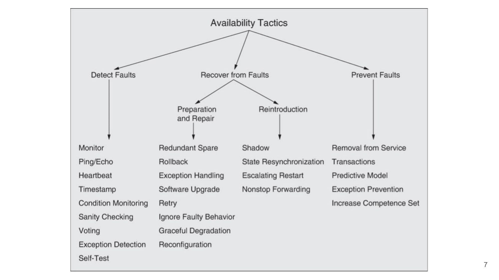
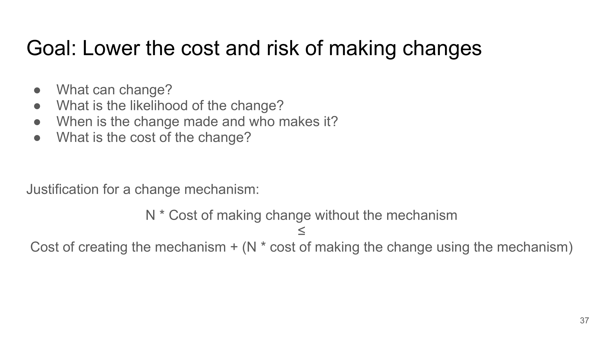

# Content

1. [Chapter 1: Software-Architecture](#chapter1)
    - [Chapter 1 - Part 1: What is Software Architecture](#chapter1part1)
    - [Chapter 1 - Part 2: Structure](#chapter1part2)
    - [Chapter 1 - Part 3: Architecture Characteristics](#chapter1part3)
    - [Chapter 1 - Part 4: Architecture Decisions](#chapter1part4)
    - [Chapter 1 - Part 5: Design Principles](#chapter1part5)
    - [Chapter 1 - Part 6: Who is the Software Architect?](#chapter1part6)
    - [Chapter 1 - Part 7: Why is Software-Architecture relevant?](#chapter1part7)
    - [Chapter 1 - Part 8: Laws of Software Architecture](#chapter1part8)
2. [Chapter 2: Architecturally Significant Requirements](#chapter2)
    - [Chapter 2 - Part 1: Architectural Thinking](#chapter2part1)
    - [Chapter 2 - Part 2: Architecture versus Design](#chapter2part2)
    - [Chapter 2 - Part 3: Technical Breadth](#chapter2part3)
    - [Chapter 2 - Part 4: Analyzing Trade-Offs](#chapter2part4)
    - [Chapter 2 - Part 5: The Four Levels of Abstraction](#chapter2part5)
    - [Chapter 2 - Part 6: Architectural Drivers](#chapter2part6)
    - [Chapter 2 - Part 7: Functional Requirements](#chapter2part7)
    - [Chapter 2 - Part 8: Business Constraints](#chapter2part8)
    - [Chapter 2 - Part 9: Technical Constraints](#chapter2part9)
    - [Chapter 2 - Part 10: Quality Attributes](#chapter2part10)
3. [Chapter 3: Quality Attributes](#chapter3)
    - [Chapter 3 - Part 1: What is the Quality Attribute of a Software?](#chapter3part1)
    - [Chapter 3 - Part 2: Availability](#chapter3part2)
    - [Chapter 3 - Part 3: Deployability](#chapter3part3)
    - [Chapter 3 - Part 4: Energy Efficiency](#chapter3part4)
    - [Chapter 3 - Part 5: Integrability](#chapter3part5)
    - [Chapter 3 - Part 6: Modifiability](#chapter3part6)
    - [Chapter 3 - Part 7: Performance](#chapter3part7)
    - [Chapter 3 - Part 8: Safety](#chapter3part8)
    - [Chapter 3 - Part 9: Security](#chapter3part9)
    - [Chapter 3 - Part 10: Testability](#chapter3part10)
    - [Chapter 3 - Part 11: Usability](#chapter3part11)
    - [Chapter 3 - Part 12: Operational Architecture Quality Attributes](#chapter3part12)
    - [Chapter 3 - Part 13: Structural Architecture Quality Attributes](#chapter3part13)
    - [Chapter 3 - Part 14: Cross-cutting Architecture Quality Attributes](#chapter3part14)
    - [Chapter 3 - Part 15: Finding Architecture Quality Attributes in the Business Constraints](#chapter3part15)
    - [Chapter 3 - Part 16: Extracting Architecture Quality Attributes from Requirements](#chapter3part16)
4. [Chapter 4: Software-Architecture Design](#chapter4)
    - [Chapter 4 - Part 1: What to do next?](#chapter4part1)
    - [Chapter 4 - Part 2: Modularity](#chapter4part2)
    - [Chapter 4 - Part 3: Component Scope](#chapter4part3)
    - [Chapter 4 - Part 4: Architecture Partitioning](#chapter4part4)
    - [Chapter 4 - Part 5: Top-down and Bottom-up Design](#chapter4part5)
    - [Chapter 4 - Part 6: Architecture-Centric Development Approaches](#chapter4part6)
5. [Chapter 5: Architectural Styles](#chapter5)
    - [Chapter 5 - Part 1: xxxxxx](#chapter5part1)
    - [Chapter 5 - Part 2: yyyyyy](#chapter5part2)
6. [Chapter 6: Communication of Software Architecture](#chapter6)
    - [Chapter 6 - Part 1: xxxxxx](#chapter6part1)
    - [Chapter 6 - Part 2: yyyyyy](#chapter6part2)
7. [Chapter 7: Software Architectures and Quality](#chapter7)
    - [Chapter 7 - Part 1: Definition](#chapter7part1)
    - [Chapter 7 - Part 2: Why analyze an architecture?](#chapter7part2)
    - [Chapter 7 - Part 3: Objectives of the analysis](#chapter7part3)
    - [Chapter 7 - Part 4: Methods for Ensuring the Quality of SA](#chapter7part4)
    - [Chapter 7 - Part 5: What can be evaluated on a software project?](#chapter7part5)
    - [Chapter 7 - Part 6: Quantitative analysis](#chapter7part6)
    - [Chapter 7 - Part 7: Qualitative evaluation](#chapter7part7)
8. [Chapter 8: Design Patterns](#chapter8)
    - [Chapter 8 - Part 1: xxxxxx](#chapter8part1)
    - [Chapter 8 - Part 2: yyyyyy](#chapter8part2)
9. [Chapter 9: Economics for Software Architects](#chapter9)
    - [Chapter 9 - Part 1: xxxxxx](#chapter9part1)
    - [Chapter 9 - Part 2: yyyyyy](#chapter9part2)
10. [Chapter 10: Architecture Modelling and Tools](#chapter10)
    - [Chapter 10 - Part 1: xxxxxx](#chapter10part1)
    - [Chapter 10 - Part 2: yyyyyy](#chapter10part2)
11. [Chapter 11: Effective Teams and the Software Architect](#chapter11)
    - [Chapter 11 - Part 1: xxxxxx](#chapter11part1)
    - [Chapter 11 - Part 2: yyyyyy](#chapter11part2)
12. [Bibliography's](#biblio)

## Chapter 1: Software-Architecture

#### Chapter 1 - Part 1: What is Software Architecture?

**Architecture is nota a phase of projects**

In this definition, software architecture consists of the structure of the system (denoted as the heavy black lines supporting the architecture), combined with architecture characteristics (“-ilities”) the system must support, architecture decisions, and finally design principles.

Architecture consists of the **structure** combined with **architecture characteristics (“-ilities”)**, **architecture decisions**, and **design principles**

#### Chapter 1 - Part 2: Structure

The structure of the system refers to the type of architecture style (or styles) the system is implemented in (such as microservices, layered, or microkernel). Describing an architecture solely by the structure does not wholly elucidate an architecture. For example, suppose an architect is asked to describe an architecture, and that architect responds “it’s a microservices architecture.” Here, the architect is only talking about the structure of the system, but not the architecture of the system. Knowledge of the architecture characteristics, architecture decisions, and design principles is also needed to fully understand the architecture of the system.

 

 Fig 1 - Structure refers to the type of architecture styles used in the system - (<a href='https://www.uc.pt/en/fctuc/dei'>Work by University of Coimbra - DEI - https://www.uc.pt/en/fctuc/dei </a>) 

 

#### Chapter 1 - Part 3: Architecture Characteristics

The architecture characteristics define the success criteria of a system, which is generally orthogonal to the functionality of the system. Notice that all of the characteristics listed do not require knowledge of the functionality of the system, yet they are required in order for the system to function properly. Architecture characteristics are so important that we’ve devoted several chapters in this book to understanding and defining them.

 

 Fig 2 - Architecture characteristics refers to the “-ilities” that the system must support - (<a href='https://www.uc.pt/en/fctuc/dei'>Work by University of Coimbra - DEI - https://www.uc.pt/en/fctuc/dei </a>) 

 

#### Chapter 1 - Part 4: Architecture Decisions

Architecture decisions define the rules for how a system should be constructed. For example, an architect might make an architecture decision that only the business and services layers within a layered architecture can access the database restricting the presentation layer from making direct database calls. Architecture decisions form the constraints of the system and direct the development teams on what is and what isn’t allowed.

If a particular architecture decision cannot be implemented in one part of the system due to some condition or other constraint, that decision (or rule) can be broken through something called a variance. Most organizations have variance models that are used by an architecture review board (ARB) or chief architect. Those models formalize the process for seeking a variance to a particular standard or architecture decision. An exception to a particular architecture decision is analyzed by the ARB (or chief architect if no ARB exists) and is either approved or denied based on justifications and trade-offs.

 

 Fig 3 - Architecture decisions are rules for constructing systems - (<a href='https://www.uc.pt/en/fctuc/dei'>Work by University of Coimbra - DEI - https://www.uc.pt/en/fctuc/dei </a>) 

 

#### Chapter 1 - Part 5: Design Principles

The last factor in the definition of architecture is design principles. A design principle differs from an architecture decision in that a design principle is a guideline rather than a hard-and-fast rule. For example, the design principle illustrated above states that the development teams should leverage asynchronous messaging between services within a microservices architecture to increase performance. An architecture decision (rule) could never cover every condition and option for communication between services, so a design principle can be used to provide guidance for the preferred method (in this case, asynchronous messaging) to allow the developer to choose a more appropriate communication protocol (such as REST or gRPC) given a specific circumstance.

 

 Fig 4 - Design principles are guidelines for constructing systems - (<a href='https://www.uc.pt/en/fctuc/dei'>Work by University of Coimbra - DEI - https://www.uc.pt/en/fctuc/dei </a>) 

 

#### Chapter 1 - Part 6: Who is the Software Architect?

There are eight core expectations placed on a software architect, irrespective of any given role, title, or job description:

- Make architecture decisions
- Continually analyze the architecture
- Keep current with latest trends
- Ensure compliance with decisions
- Diverse exposure and experience
- Have business domain knowledge
- Possess interpersonal skills
- Understand and navigate politics

 

 Fig 5 - Software Architecture Role - (<a href='https://www.uc.pt/en/fctuc/dei'>Work by University of Coimbra - DEI - https://www.uc.pt/en/fctuc/dei </a>) 

 

#### Chapter 1 - Part 7: Why is Software-Architecture relevant?

- Inhibit or enable a system’s driving quality attributes.
- Reason about and manage change as the system evolves.
- Early prediction of a system’s qualities.
- Enhances communication among stakeholders.
- Carrier of the earliest, and hence most-fundamental, hardest-to-change design decisions.
- Defines a set of constraints on subsequent implementation.
- Dictates the structure of an organization, or vice versa.
- Provide the basis for incremental development.
- Key artifact that allows the architect and the project manager to reason about cost and schedule.
- Can be created as a transferable, reusable model that forms the heart of a product line.
- Focuses attention on the assembly of components, rather than simply on their creation.
- By restricting design alternatives, architecture channels the creativity of developers, reducing design and system complexity.
- Foundation for training of a new team member.

#### Chapter 1 - Part 8: Laws of Software Architecture

While the scope of software architecture is almost impossibly broad, unifying elements do exist. The authors have first and foremost learned the First Law of Software Architecture by constantly stumbling across it:

**Everything in software architecture is a trade-off.** —First Law of Software Architecture

Nothing exists on a nice, clean spectrum for software architects. Every decision must take into account many opposing factors.

**If an architect thinks they have discovered something that isn’t a trade-off, more likely they just haven’t identified the trade-off yet.** —Corollary 1

We define software architecture in terms beyond structural scaffolding, incorporating principles, characteristics, and so on. Architecture is broader than just the combination of structural elements, reflected in our Second Law of Software Architecture:

**Why is more important than how.** —Second Law of Software Architecture

The authors discovered the importance of this perspective when we tried keeping the results of exercises done by students during workshop as they crafted architecture solutions. Because the exercises were timed, the only artifacts we kept were the diagrams representing the topology. In other words, we captured how they solved the problem but not why the team made particular choices. An architect can look at an existing system they have no knowledge of and ascertain how the structure of the architecture works, but will struggle explaining why certain choices were made versus others.

## Chapter 2: Architecturally Significant Requirements

#### Chapter 2 - Part 1: Architectural Thinking

An architect sees things differently from a developer’s point of view, much in the same way a meteorologist might see clouds differently from an artist’s point of view.

This is called architectural thinking. Unfortunately, too many architects believe that architectural thinking is simply just “thinking about the architecture.”

Architectural thinking is much more than that. It is seeing things with an architectural eye, or an architectural point of view. There are four main aspects of thinking like an architect:

- **First, it’s understanding the difference between architecture and design and knowing how to collaborate with development teams to make architecture work.** 

- **Second, it’s about having a wide breadth of technical knowledge while still maintaining a certain level of technical depth, allowing the architect to see solutions and possibilities that others do not see.** 

- **Third, it’s about understanding, analyzing, and reconciling trade-offs between various solutions and technologies.** 

- **Finally, it’s about understanding the importance of business drivers and how they translate to architectural concerns.**

#### Chapter 2 - Part 2: Architecture versus Design

As shown in the diagram, an architect is responsible for things like analyzing business requirements to extract and define the architectural characteristics (“-ilities”), selecting which architecture patterns and styles would fit the problem domain, and creating components (the building blocks of the system). The artifacts created from these activities are then handed off to the development team, which is responsible for creating class diagrams for each component, creating user interface screens, and developing and testing source code.

To make architecture work, both the physical and virtual barriers that exist between architects and developers must be broken down, thus forming a strong bidirectional relationship between architects and development teams. The architect and developer must be on the same virtual team to make this work. Not only does this model facilitate strong bidirectional communication between architecture and development, but it also allows the architect to provide mentoring and coaching to developers on the team.

Unlike the old-school waterfall approaches to static and rigid software architecture, the architecture of today’s systems changes and evolves every iteration or phase of a project. A tight collaboration between the architect and the development team is essential for the success of any software project. So where does architecture end and design begin? It doesn’t. They are both part of the circle of life within a software project and must always be kept in synchronization with each other in order to succeed.

 

 Fig 6 - Architecture Versus Design - (<a href='https://www.uc.pt/en/fctuc/dei'>Work by University of Coimbra - DEI - https://www.uc.pt/en/fctuc/dei </a>) 

 

#### Chapter 2 - Part 3: Technical Breadth

The scope of technological detail differs between developers and architects. Unlike a developer, who must have a significant amount of technical depth to perform their job, a software architect must have a significant amount of technical breadth to think like an architect and see things with an architecture point of view. This is illustrated by the knowledge pyramid shown above, which encapsulates all the technical knowledge in the world. It turns out that the kind of information a technologist should value differs with career stages. any individual can partition all their knowledge into three sections: stuff you know, stuff you know you don’t know, and stuff you don’t know you don’t know.

**Stuff you know**: includes the technologies, frameworks, languages, and tools a technologist uses on a daily basis to perform their job, such as knowing Java as a Java programmer. 

**Stuff you know you don’t know**: includes those things a technologist knows a little about or has heard of but has little or no expertise in. A good example of this level of knowledge is the Clojure programming language. Most technologists have heard of Clojure and know it’s a programming language based on Lisp, but they can’t code in the language. 

**Stuff you don’t know you don’t know**: is the largest part of the knowledge triangle and includes the entire host of technologies, tools, frameworks, and languages that would be the perfect solution to a problem a technologist is trying to solve, but the technologist doesn’t even know those things exist.

However, the nature of knowledge changes as developers transition into the architect role. A large part of the value of an architect is a broad understanding of technology and how to use it to solve particular problems. For example, as an architect, it is more beneficial to know that five solutions exist for a particular problem than to have singular expertise in only one. The most important parts of the pyramid for architects are the top and middle sections; how far the middle section penetrates into the bottom section represents an architect’s technical breadth

Architects should focus on technical breadth so that they have a larger quiver from which to draw arrows. Developers transitioning to the architect role may have to change the way they view knowledge acquisition. Balancing their portfolio of knowledge regarding depth versus breadth is something every developer should consider throughout their career.

 

 Fig 7 - Technical Breadth - (<a href='https://www.uc.pt/en/fctuc/dei'>Work by University of Coimbra - DEI - https://www.uc.pt/en/fctuc/dei </a>) 

 

#### Chapter 2 - Part 4: Analyzing Trade-Offs

Thinking like an architect is all about seeing trade-offs in every solution, technical or otherwise, and analyzing those trade-offs to determine what is the best solution. To quote Mark (one of your authors):

- **Architecture is the stuff you can’t Google.**

Everything in architecture is a trade-off, which is why the famous answer to every architecture question in the universe is “it depends.” While many people get increasingly annoyed at this answer, it is unfortunately true. You cannot Google the answer to whether REST or messaging would be better, or whether microservices is the right architecture style, because it does depend. It depends on the deployment environment, business drivers, company culture, budgets, timeframes, developer skill set, and dozens of other factors. Everyone’s environment, situation, and problem is different, hence why architecture is so hard. To quote Neal (another one of your authors):

- **There are no right or wrong answers in architecture—only trade-offs.**

For example, consider an item auction system where someone places a bid for an item up for auction.

 

 Fig 8 - Auction system example of a trade-off—queues or topics? - (<a href='https://www.uc.pt/en/fctuc/dei'>Work by University of Coimbra - DEI - https://www.uc.pt/en/fctuc/dei </a>) 

 

The Bid Producer service generates a bid from the bidder and then sends that bid amount to the Bid Capture, Bid Tracking, and Bid Analytics services. This could be done by using queues in a point-to-point messaging fashion or by using a topic in a publish-and-subscribe messaging fashion. Which one should the architect use? You can’t Google the answer. Architectural thinking requires the architect to analyze the trade-offs associated with each option and select the best one given the specific situation.

The two messaging options for the item auction system illustrating the use of a topic in a publish-and-subscribe messaging model,and illustrating the use of queues in a point-to-point messaging model.

 

 Fig 9 - Use of a topic for communication between services - (<a href='https://www.uc.pt/en/fctuc/dei'>Work by University of Coimbra - DEI - https://www.uc.pt/en/fctuc/dei </a>) 

 

 

 Fig 10 - Use of queues for communication between services - (<a href='https://www.uc.pt/en/fctuc/dei'>Work by University of Coimbra - DEI - https://www.uc.pt/en/fctuc/dei </a>) 

 

The clear advantage (and seemingly obvious solution) to this problem in Figure 9 is that of architectural extensibility. The Bid Producer service only requires a single connection to a topic, unlike the queue solution in Figure 10 where the Bid Pro ducer needs to connect to three different queues. If a new service called Bid History were to be added to this system due to the requirement to provide each bidder with a history of all the bids they made in each auction, no changes at all would be needed to the existing system. When the new Bid History service is created, it could simply subscribe to the topic already containing the bid information. In the queue option shown in Figure 10, however, a new queue would be required for the Bid History service, and the Bid Producer would need to be modified to add an additional connection to the new queue. The point here is that using queues requires significant change to the system when adding new bidding functionality, whereas with the topic approach no changes are needed at all in the existing infrastructure. Also, notice that the Bid Producer is more decoupled in the topic option—the Bid Producer doesn’t know how the bidding information will be used or by which services. In the queue option the Bid Producer knows exactly how the bidding information is used (and by whom), and hence is more coupled to the system.

Thinking architecturally is looking at the benefits of a given solution, but also analyzing the negatives, or trade-offs, associated with a solution. Continuing with the auction system example, a software architect would analyze the negatives of the topic solution. In analyzing the differences, notice first in Figure 9 that with a topic, anyone can access bidding data, which introduces a possible issue with data access and data security. In the queue model illustrated in Figure 10, the data sent to the queue can only be accessed by the specific consumer receiving that message. If a rogue service did listen in on a queue, those bids would not be received by the corresponding service, and a notification would immediately be sent about the loss of data (and hence a possible security breach). In other words, it is very easy to wiretap into a topic, but not a queue.

In addition to the security issue, the topic solution in Figure 9 only supports homogeneous contracts. All services receiving the bidding data must accept the same contract and set of bidding data. In the queue option in Figure 10, each consumer can have its own contract specific to the data it needs. For example, suppose the new Bid History service requires the current asking price along with the bid, but no other service needs that information. In this case, the contract would need to be modified, impacting all other services using that data. In the queue model, this would be a separate channel, hence a separate contract not impacting any other service.

Another disadvantage of the topic model illustrated in Figure 9 is that it does not support monitoring of the number of messages in the topic and hence auto-scaling capabilities. However, with the queue option in Figure 10, each queue can be monitored individually, and programmatic load balancing applied to each bidding consumer so that each can be automatically scaled independency from one another. Note that this trade-off is technology specific in that the Advanced Message Queuing Protocol (AMQP) can support programmatic load balancing and monitoring because of the separation between an exchange (what the producer sends to) and a queue (what the consumer listens to).

Given this trade-off analysis, now which is the better option? And the answer? It depends!

| Topic advantages             | Topic disadvantages                       |
|:-----------------------------|:------------------------------------------|
| Architectural extensibility  | Data access and data security concerns    |
| Service decoupling           | No heterogeneous contracts                |
|                              | Monitoring and programmatic scalability   |

The point here is that everything in software architecture has a trade-off: an advantage and disadvantage. Thinking like an architect is analyzing these trade-offs, then asking “which is more important: extensibility or security?” The decision between different solutions will always depend on the business drivers, environment, and a host of other factors.

#### Chapter 2 - Part 5: The Four Levels of Abstraction

 

 Fig 11 - The Four Levels of Abstraction - (<a href='https://www.uc.pt/en/fctuc/dei'>Work by University of Coimbra - DEI - https://www.uc.pt/en/fctuc/dei </a>) 

 

#### Chapter 2 - Part 6: Architectural Drivers

Architectural drivers (or Architecturally Significant Requirements - ASRs) are requirements that shape the architecture and include:

 

 Fig 12 - Architecturally Significant Requirements - (<a href='https://www.uc.pt/en/fctuc/dei'>Work by University of Coimbra - DEI - https://www.uc.pt/en/fctuc/dei </a>) 

 

Architectural drivers consist of coarse-grained or high-level functional requirements, technical constraints, business constraints, and quality attribute requirements. Each of these exerts forces on the architect and influences the early design decisions that the architect makes. However, the impact of each on the design can be radically different, and they are often in tension with one another. **High-level functionality** is an obvious architectural driver and refers to those general requirements for what the system must do. **Technical and business constraints** are fixed premade decisions that are in place before design begins. **Quality attribute requirements** are properties that the system must possess, such as availability, security, high performance, and so forth. Although it may seem counterintuitive, functional requirements have the least influence on design.

 

 Fig 13 - The architectural drivers and their influence on system design. - (<a href='https://www.uc.pt/en/fctuc/dei'>Work by University of Coimbra - DEI - https://www.uc.pt/en/fctuc/dei </a>) 

 

**Were to find these requirements?**

They are not always found in the "requirements document"!

- Many projects do not create or maintain detailed, high-quality documents
- More attention is paid to functional requirements
- Most requirements do not affect the architecture
- Can not wait for requirements to be ready

**When captured, quality attributes are often poorly captured**

- "The system must be modular"
- "The system must have good usability"
- "The system must meet the performance requirements"

**Much of what is important to the architect is not even in the rest**

- ASRs often derive from business objectives
- Qualities of the development team

 

 Fig 14 - Looking for ASRs. - (<a href='https://www.uc.pt/en/fctuc/dei'>Work by University of Coimbra - DEI - https://www.uc.pt/en/fctuc/dei </a>) 

 

**Collect ASRs from stakeholders**

Stakeholders do not know what quality attributes they want in the system

- Insisting on quantitative AQs can result in arbitrary values

Some of these requirements may be difficult to meet

Often, the architect has a more reasonable idea

**Interviewing stakeholders is the best way to determine what they know and what they need**

**The outcome of the stakeholder interviews should include**:

- A list of architectural drivers
- A list of quality attributes scenarios that stakeholders as a whole prioritized

**The information can be used to:**

- Refine the system and software requirements
- Understand and clarify architectural drivers
- Provide the rationale for design decisions
- Guide the development of prototypes and simulations
- Influence the order in which the architecture is developed

#### Chapter 2 - Part 7: Functional Requirements

- Functional requirements explain what the system should do

- At the architectural level, what matters is the high-level functionality and not the details

- As the architecture is refined, more information about the requirements is gathered

High-level functional requirements describe in general terms what a system must do. The term high-level is used here to mean general descriptions of functionality, not the details of what is needed. Consider an air traffic control system. For architectural design, it is important that the system tracks air traffic, records flight plans, and prevents collisions, but the kinds of widgets, the colors of the entities on the displays, and other details are not important for architectural design. Although these are important requirements, they typically have little impact on systemic design choices, and they will be developed in detail as the project progresses.

At the architectural level, what matters is the high-level functionality and not the details.

**Communicating Functional Requirements**

- Descriptions
- Use cases

#### Chapter 2 - Part 8: Business Constraints

**Constraints**

A constraint is a design decision with 0 (zero) degrees of freedom. That is, it is a pre-existing decision.

**Business Constraints**

- Constraints with architectural impact
- Target market and "time-to-market"
- Cost and benefit expectations
- Delivery process (incremental delivery)
- Expected lifetime of the system
- Availability of resources and experience
- Product lines

**Communication of Business constraints**

- Source
   - Person or artifact that provides the objective
- Subject
   - The stakeholder promoting the objective, individual or organizatione
- Object
   - Entity to which the objective applies
- Environment
   - The context for meeting the goal
   - Social, legal, competitive, client, technological
- Objective
- Description
- Measure
   - A testable metric to validate whether the goal has been achieved
- Pedigree and value
   - The degree of confidence that the person who defined the goal has in it
   - The volatility and value of the objective

#### Chapter 2 - Part 9: Technical Constraints

**Constraints**

A constraint is a design decision with 0 (zero) degrees of freedom. That is, it is a pre-existing decision.

**Technical Constraints**

- Pre-existing design decisions that shape the architecture
- Use or integration with legacy systems
- Technologies, programming languages, protocols, standards, among others.
- They may have different origins, but all have an impact on architecture

**Communication of technical constraints**

- Rationale
- Rationale
- Viable alternatives
- Origin (stakeholders)

#### Chapter 2 - Part 10: Quality Attributes

Quality attributes are characteristics that the system must have in addition to functionality and are also called "Non-Functional Requirements"

- This term is confusing because it is impossible to describe a quality attribute and some constraints without including functionality

Quality attributes are the most difficult architectural drivers to identify, define, and test.

Quality attributes and architectural constraints condition architecture much more than functional requirements

The architecture is fundamental to ensure the fulfillment of quality attributes

Promoting a quality attribute in the architecture can negatively influence the fulfillment of another quality attribute.

Architecture is essential for balancing tradeoffs between quality attributes.

- Availability vs. Performance
- Performance vs. Security
- Portability vs extensibility

Most of the time, quality attributes are in "tension" with each other and It is important to prioritize quality attributes. Some qualities of the system have no impact on the architecture, like Usability (Choosing buttons, form elements and etc...)

**Communication of Quality Attributes**

- Quality attributes are difficult to identify and describe
- Just using the name is not enough
- Vocabulary varies
- Descriptions are vague and non-quantifiable
- Literature definitions are too simple and unhelpful
- They are often the source of little useful discussions

Ex: "The system must be modifiable"

- Useless ... The system is not always modifiable and does not support any and all changes
- Each system is modifiable in response to some but not all changes
- What prevents the modification of a system is cost and time

An efficient way to describe quality attributes is the **Scenarios** that we can Quantify quality attributes, Prioritize scenarios, Make architectural decisions that balance quality attributes and The quantification allows to measure compliance, completeness and success

**Scenarios of quality attributes**

An efficient way to describe quality attributes
Quantify quality attributes through scenarios
Prioritize scenarios
Make architectural decisions that balance quality attributes
The quantification allows to measure compliance, completeness and success

**Stimulus source**
   - This is an entity (a human being a computer system, or any other actuator) that generated the stimulus.
   
**Stimulus**
   - Stimulation is a condition that requires an answer when one arrives at a system.
   
**Environment**
   - Stimulation occurs under certain conditions. The system may be in an overload condition or in normal operation, or some other relevant condition. For many systems, the "normal" operation may refer to one of a number of modes.
   
**Artifact**
   - Some artifact is stimulated. This can be a collection of systems, the whole system, or some part or parts of it.
   
**Response**
   - The response is the specific activity as the result of the arrival of the stimulus.
   
**Measure the response**
   - When the response occurs, it must be measured in some way so that the requirement can be tested.

 

 Fig 15 - Quality Scenario Example - (<a href='https://www.uc.pt/en/fctuc/dei'>Work by University of Coimbra - DEI - https://www.uc.pt/en/fctuc/dei </a>) 

 

## Chapter 3: Quality Attributes

#### Chapter 3 - Part 1: What is the Quality Attribute of a Software?

We have been using the term “quality attribute” loosely, but now it is time to define it more carefully. A quality attribute (QA) is a measurable or testable property of a system that is used to indicate how well the system satisfies the needs of its stakeholders. You can think of a quality attribute as measuring the “goodness” of a product along some dimension of interest to a stakeholder.

A quality attribute requirement should be unambiguous and testable. We use a common form to specify all quality attribute requirements. This has the advantage of emphasizing the commonalities among all quality attributes. It has the disadvantage of occasionally being a force-fit for some aspects of quality attributes

**Stimulus**: We use the term “stimulus” to describe an event arriving at the system. The stimulus can be an event to the performance community, a user operation to the usability community, or an attack to the security community. We use the same term to describe a motivating action for developmental qualities. Thus, a stimulus for modifiability is a request for a modification; a stimulus for testability is the completion of a phase of development.

**Stimulus source**: A stimulus must have a source—it must come from somewhere. The source of the stimulus may affect how it is treated by the system. A request from a trusted user will not undergo the same scrutiny as a request by an untrusted user.

**Response**: How the system should respond to the stimulus must also be specified. The response consists of the responsibilities that the system (for runtime qualities) or the developers (for development-time qualities) should perform in response to the stimulus. For example, in a performance scenario, an event arrives (the stimulus) and the system should process that event and generate a response. In a modifiability scenario, a request for a modification arrives (the stimulus) and the developers should implement the modification—without side effects—and then test and deploy the modification.

**Response measure**: Determining whether a response is satisfactory— whether the requirement is satisfied—is enabled by providing a response measure. For performance this could be a measure of latency or throughput; for modifiability it could be the labor or wall clock time required to make, test, and deploy the modification.

**Environment**: The environment of a requirement is the set of circumstances in which the scenario takes place. The environment acts as a qualifier on the stimulus. For example, a request for a modification that arrives after the code has been frozen for a release may be treated differently than one that arrives before the freeze. A failure that is the fifth successive failure of a component may be treated differently than the first failure of that component.

**Artifact**: Finally, the artifact is the portion of the system to which the requirement applies. Frequently this is the entire system, but occasionally specific portions of the system may be called out. A failure in a data store may be treated differently than a failure in the metadata store. Modifications to the user interface may have faster response times than modifications to the middleware.

**summary**

**Source of stimulus**: This is some entity (a human, a computer system, or any other actuator) that generated the stimulus.

**Stimulus**: The stimulus is a condition that requires a response when it arrives at a system.

**Environment**: The stimulus occurs under certain conditions. The system may be in an overload condition or in normal operation, or some other relevant state. For many systems, “normal” operation can refer to one of a number of modes. For these kinds of systems, the environment should specify in which mode the system is executing.

**Artifact**: Some artifact is stimulated. This may be a collection of systems, the whole system, or some piece or pieces of it.

**Response**: The response is the activity undertaken as the result of the arrival of the stimulus.

**Response measure**: When the response occurs, it should be measurable in some fashion so that the requirement can be tested.

 

 Fig 16 - System Software Product Quality - (<a href='https://www.uc.pt/en/fctuc/dei'>Work by University of Coimbra - DEI - https://www.uc.pt/en/fctuc/dei </a>) 

 

#### Chapter 3 - Part 2: Availability

 

 (<a href='https://www.uc.pt/en/fctuc/dei'>Work by University of Coimbra - DEI - https://www.uc.pt/en/fctuc/dei </a>) 

 

 (<a href='https://www.uc.pt/en/fctuc/dei'>Work by University of Coimbra - DEI - https://www.uc.pt/en/fctuc/dei </a>) 

 

 (<a href='https://www.uc.pt/en/fctuc/dei'>Work by University of Coimbra - DEI - https://www.uc.pt/en/fctuc/dei </a>) 

 

 (<a href='https://www.uc.pt/en/fctuc/dei'>Work by University of Coimbra - DEI - https://www.uc.pt/en/fctuc/dei </a>) 

 

 (<a href='https://www.uc.pt/en/fctuc/dei'>Work by University of Coimbra - DEI - https://www.uc.pt/en/fctuc/dei </a>) 

 

 (<a href='https://www.uc.pt/en/fctuc/dei'>Work by University of Coimbra - DEI - https://www.uc.pt/en/fctuc/dei </a>) 

 

#### Chapter 3 - Part 3: Deployability

 

 (<a href='https://www.uc.pt/en/fctuc/dei'>Work by University of Coimbra - DEI - https://www.uc.pt/en/fctuc/dei </a>) 

 

 (<a href='https://www.uc.pt/en/fctuc/dei'>Work by University of Coimbra - DEI - https://www.uc.pt/en/fctuc/dei </a>) 

 

 (<a href='https://www.uc.pt/en/fctuc/dei'>Work by University of Coimbra - DEI - https://www.uc.pt/en/fctuc/dei </a>) 

 

 (<a href='https://www.uc.pt/en/fctuc/dei'>Work by University of Coimbra - DEI - https://www.uc.pt/en/fctuc/dei </a>) 

 

 (<a href='https://www.uc.pt/en/fctuc/dei'>Work by University of Coimbra - DEI - https://www.uc.pt/en/fctuc/dei </a>) 

 

 (<a href='https://www.uc.pt/en/fctuc/dei'>Work by University of Coimbra - DEI - https://www.uc.pt/en/fctuc/dei </a>) 

 

 (<a href='https://www.uc.pt/en/fctuc/dei'>Work by University of Coimbra - DEI - https://www.uc.pt/en/fctuc/dei </a>) 

 

 (<a href='https://www.uc.pt/en/fctuc/dei'>Work by University of Coimbra - DEI - https://www.uc.pt/en/fctuc/dei </a>) 

 

 (<a href='https://www.uc.pt/en/fctuc/dei'>Work by University of Coimbra - DEI - https://www.uc.pt/en/fctuc/dei </a>) 

 

#### Chapter 3 - Part 4: Energy Efficiency

 

 (<a href='https://www.uc.pt/en/fctuc/dei'>Work by University of Coimbra - DEI - https://www.uc.pt/en/fctuc/dei </a>) 

 

 (<a href='https://www.uc.pt/en/fctuc/dei'>Work by University of Coimbra - DEI - https://www.uc.pt/en/fctuc/dei </a>) 

 

 (<a href='https://www.uc.pt/en/fctuc/dei'>Work by University of Coimbra - DEI - https://www.uc.pt/en/fctuc/dei </a>) 

 

 (<a href='https://www.uc.pt/en/fctuc/dei'>Work by University of Coimbra - DEI - https://www.uc.pt/en/fctuc/dei </a>) 

 

 (<a href='https://www.uc.pt/en/fctuc/dei'>Work by University of Coimbra - DEI - https://www.uc.pt/en/fctuc/dei </a>) 

 

 (<a href='https://www.uc.pt/en/fctuc/dei'>Work by University of Coimbra - DEI - https://www.uc.pt/en/fctuc/dei </a>) 

 

#### Chapter 3 - Part 5: Integrability

 

 (<a href='https://www.uc.pt/en/fctuc/dei'>Work by University of Coimbra - DEI - https://www.uc.pt/en/fctuc/dei </a>) 

 

 (<a href='https://www.uc.pt/en/fctuc/dei'>Work by University of Coimbra - DEI - https://www.uc.pt/en/fctuc/dei </a>) 

 

 (<a href='https://www.uc.pt/en/fctuc/dei'>Work by University of Coimbra - DEI - https://www.uc.pt/en/fctuc/dei </a>) 

 

 (<a href='https://www.uc.pt/en/fctuc/dei'>Work by University of Coimbra - DEI - https://www.uc.pt/en/fctuc/dei </a>) 

 

 (<a href='https://www.uc.pt/en/fctuc/dei'>Work by University of Coimbra - DEI - https://www.uc.pt/en/fctuc/dei </a>) 

 

 (<a href='https://www.uc.pt/en/fctuc/dei'>Work by University of Coimbra - DEI - https://www.uc.pt/en/fctuc/dei </a>) 

 

 (<a href='https://www.uc.pt/en/fctuc/dei'>Work by University of Coimbra - DEI - https://www.uc.pt/en/fctuc/dei </a>) 

 

#### Chapter 3 - Part 6: Modifiability

 

 (<a href='https://www.uc.pt/en/fctuc/dei'>Work by University of Coimbra - DEI - https://www.uc.pt/en/fctuc/dei </a>) 

 

 (<a href='https://www.uc.pt/en/fctuc/dei'>Work by University of Coimbra - DEI - https://www.uc.pt/en/fctuc/dei </a>) 

 

 (<a href='https://www.uc.pt/en/fctuc/dei'>Work by University of Coimbra - DEI - https://www.uc.pt/en/fctuc/dei </a>) 

 

 (<a href='https://www.uc.pt/en/fctuc/dei'>Work by University of Coimbra - DEI - https://www.uc.pt/en/fctuc/dei </a>) 

 

 (<a href='https://www.uc.pt/en/fctuc/dei'>Work by University of Coimbra - DEI - https://www.uc.pt/en/fctuc/dei </a>) 

 

 (<a href='https://www.uc.pt/en/fctuc/dei'>Work by University of Coimbra - DEI - https://www.uc.pt/en/fctuc/dei </a>) 

 

 (<a href='https://www.uc.pt/en/fctuc/dei'>Work by University of Coimbra - DEI - https://www.uc.pt/en/fctuc/dei </a>) 

 

 (<a href='https://www.uc.pt/en/fctuc/dei'>Work by University of Coimbra - DEI - https://www.uc.pt/en/fctuc/dei </a>) 

 

#### Chapter 3 - Part 7: Performance

 

 (<a href='https://www.uc.pt/en/fctuc/dei'>Work by University of Coimbra - DEI - https://www.uc.pt/en/fctuc/dei </a>) 

 

 (<a href='https://www.uc.pt/en/fctuc/dei'>Work by University of Coimbra - DEI - https://www.uc.pt/en/fctuc/dei </a>) 

 

 (<a href='https://www.uc.pt/en/fctuc/dei'>Work by University of Coimbra - DEI - https://www.uc.pt/en/fctuc/dei </a>) 

 

 (<a href='https://www.uc.pt/en/fctuc/dei'>Work by University of Coimbra - DEI - https://www.uc.pt/en/fctuc/dei </a>) 

 

 (<a href='https://www.uc.pt/en/fctuc/dei'>Work by University of Coimbra - DEI - https://www.uc.pt/en/fctuc/dei </a>) 

 

 (<a href='https://www.uc.pt/en/fctuc/dei'>Work by University of Coimbra - DEI - https://www.uc.pt/en/fctuc/dei </a>) 

 

#### Chapter 3 - Part 7: Safety

 

 (<a href='https://www.uc.pt/en/fctuc/dei'>Work by University of Coimbra - DEI - https://www.uc.pt/en/fctuc/dei </a>) 

 

 (<a href='https://www.uc.pt/en/fctuc/dei'>Work by University of Coimbra - DEI - https://www.uc.pt/en/fctuc/dei </a>) 

 

 (<a href='https://www.uc.pt/en/fctuc/dei'>Work by University of Coimbra - DEI - https://www.uc.pt/en/fctuc/dei </a>) 

 

 (<a href='https://www.uc.pt/en/fctuc/dei'>Work by University of Coimbra - DEI - https://www.uc.pt/en/fctuc/dei </a>) 

 

 (<a href='https://www.uc.pt/en/fctuc/dei'>Work by University of Coimbra - DEI - https://www.uc.pt/en/fctuc/dei </a>) 

 

 (<a href='https://www.uc.pt/en/fctuc/dei'>Work by University of Coimbra - DEI - https://www.uc.pt/en/fctuc/dei </a>) 

 

 (<a href='https://www.uc.pt/en/fctuc/dei'>Work by University of Coimbra - DEI - https://www.uc.pt/en/fctuc/dei </a>) 

 

 (<a href='https://www.uc.pt/en/fctuc/dei'>Work by University of Coimbra - DEI - https://www.uc.pt/en/fctuc/dei </a>) 

 

#### Chapter 3 - Part 7: Security

 

 (<a href='https://www.uc.pt/en/fctuc/dei'>Work by University of Coimbra - DEI - https://www.uc.pt/en/fctuc/dei </a>) 

 

 (<a href='https://www.uc.pt/en/fctuc/dei'>Work by University of Coimbra - DEI - https://www.uc.pt/en/fctuc/dei </a>) 

 

 (<a href='https://www.uc.pt/en/fctuc/dei'>Work by University of Coimbra - DEI - https://www.uc.pt/en/fctuc/dei </a>) 

 

 (<a href='https://www.uc.pt/en/fctuc/dei'>Work by University of Coimbra - DEI - https://www.uc.pt/en/fctuc/dei </a>) 

 

 (<a href='https://www.uc.pt/en/fctuc/dei'>Work by University of Coimbra - DEI - https://www.uc.pt/en/fctuc/dei </a>) 

 

 (<a href='https://www.uc.pt/en/fctuc/dei'>Work by University of Coimbra - DEI - https://www.uc.pt/en/fctuc/dei </a>) 

 

 (<a href='https://www.uc.pt/en/fctuc/dei'>Work by University of Coimbra - DEI - https://www.uc.pt/en/fctuc/dei </a>) 

 

#### Chapter 3 - Part 10: Testability

 

 (<a href='https://www.uc.pt/en/fctuc/dei'>Work by University of Coimbra - DEI - https://www.uc.pt/en/fctuc/dei </a>) 

 

 (<a href='https://www.uc.pt/en/fctuc/dei'>Work by University of Coimbra - DEI - https://www.uc.pt/en/fctuc/dei </a>) 

 

 (<a href='https://www.uc.pt/en/fctuc/dei'>Work by University of Coimbra - DEI - https://www.uc.pt/en/fctuc/dei </a>) 

 

 (<a href='https://www.uc.pt/en/fctuc/dei'>Work by University of Coimbra - DEI - https://www.uc.pt/en/fctuc/dei </a>) 

 

 (<a href='https://www.uc.pt/en/fctuc/dei'>Work by University of Coimbra - DEI - https://www.uc.pt/en/fctuc/dei </a>) 

 

 (<a href='https://www.uc.pt/en/fctuc/dei'>Work by University of Coimbra - DEI - https://www.uc.pt/en/fctuc/dei </a>) 

 

 (<a href='https://www.uc.pt/en/fctuc/dei'>Work by University of Coimbra - DEI - https://www.uc.pt/en/fctuc/dei </a>) 

 

#### Chapter 3 - Part 11: Usability

 

 (<a href='https://www.uc.pt/en/fctuc/dei'>Work by University of Coimbra - DEI - https://www.uc.pt/en/fctuc/dei </a>) 

 

 (<a href='https://www.uc.pt/en/fctuc/dei'>Work by University of Coimbra - DEI - https://www.uc.pt/en/fctuc/dei </a>) 

 

 (<a href='https://www.uc.pt/en/fctuc/dei'>Work by University of Coimbra - DEI - https://www.uc.pt/en/fctuc/dei </a>) 

 

 (<a href='https://www.uc.pt/en/fctuc/dei'>Work by University of Coimbra - DEI - https://www.uc.pt/en/fctuc/dei </a>) 

 

 (<a href='https://www.uc.pt/en/fctuc/dei'>Work by University of Coimbra - DEI - https://www.uc.pt/en/fctuc/dei </a>) 

 

 (<a href='https://www.uc.pt/en/fctuc/dei'>Work by University of Coimbra - DEI - https://www.uc.pt/en/fctuc/dei </a>) 

 

#### Chapter 3 - Part 12: Operational Architecture Quality Attributes

 

 (<a href='https://www.uc.pt/en/fctuc/dei'>Work by University of Coimbra - DEI - https://www.uc.pt/en/fctuc/dei </a>) 

 

#### Chapter 3 - Part 13: Structural Architecture Quality Attributes

 

 (<a href='https://www.uc.pt/en/fctuc/dei'>Work by University of Coimbra - DEI - https://www.uc.pt/en/fctuc/dei </a>) 

 

#### Chapter 3 - Part 14: Cross-cutting Architecture Quality Attributes

 

 (<a href='https://www.uc.pt/en/fctuc/dei'>Work by University of Coimbra - DEI - https://www.uc.pt/en/fctuc/dei </a>) 

 

 (<a href='https://www.uc.pt/en/fctuc/dei'>Work by University of Coimbra - DEI - https://www.uc.pt/en/fctuc/dei </a>) 

 

#### Chapter 3 - Part 15: Finding Architecture Quality Attributes in the Business Constraints

 

 (<a href='https://www.uc.pt/en/fctuc/dei'>Work by University of Coimbra - DEI - https://www.uc.pt/en/fctuc/dei </a>) 

 

#### Chapter 3 - Part 16: Extracting Architecture Quality Attributes from Requirements

 

 (<a href='https://www.uc.pt/en/fctuc/dei'>Work by University of Coimbra - DEI - https://www.uc.pt/en/fctuc/dei </a>) 

 

## Chapter 4: Software-Architecture Design

#### Chapter 4 - Part 1: What to do next?

Translate ASRs to Architecture decisions.

#### Chapter 4 - Part 2: Modularity

Each of a set of standardized parts or independent units that can be used to construct a more complex structure

Modularity is an organizing principle. If an architect designs a system without paying attention to how the pieces wire together, they end up creating a system that presents myriad difficulties. To use a physics analogy, software systems model complex systems, which tend toward entropy (or disorder). Energy must be added to a physical system to preserve order. The same is true for software systems: architects must constantly expend energy to ensure good structural soundness, which won’t happen by accident.

Preserving good modularity exemplifies our definition of an implicit architecture characteristic: virtually no project features a requirement that asks the architect to ensure good modular distinction and communication, yet sustainable code bases require order and consistency.

We use modularity to describe a logical grouping of related code, which could be a group of classes in an object-oriented language or functions in a structured or functional language. Most languages provide mechanisms for modularity (package in Java, namespace in .NET, and so on). Developers typically use modules as a way to group related code together. For example, the com.mycompany.customer package in Java should contain things related to customers.

Architects must be aware of how developers package things because it has important implications in architecture. For example, if several packages are tightly coupled together, reusing one of them for related work becomes more difficult.

For discussions about architecture, we use modularity as a general term to denote a related grouping of code: classes, functions, or any other grouping. This doesn’t imply a physical separation, merely a logical one; the difference is sometimes important. For example, lumping a large number of classes together in a monolithic application may make sense from a convenience standpoint. However, when it comes time to restructure the architecture, the coupling encouraged by loose partitioning becomes an impediment to breaking the monolith apart. Thus, it is useful to talk about modularity as a concept separate from the physical separation forced or implied by a particular platform.

**Cohesion**

Cohesion refers to what extent the parts of a module should be contained within the same module. In other words, it is a measure of how related the parts are to one another. Ideally, a cohesive module is one where all the parts should be packaged together, because breaking them into smaller pieces would require coupling the parts together via calls between modules to achieve useful results.

**Functional cohesion**: Every part of the module is related to the other, and the module contains everything essential to function.

**Sequential cohesion**:Two modules interact, where one outputs data that becomes the input for the other.

**Communicational cohesion**: Two modules form a communication chain, where each operates on information and/or contributes to some output. For example, add a record to the database and generate an email based on that information.

**Procedural cohesion**:Two modules must execute code in a particular order.

**Temporal cohesion**: Modules are related based on timing dependencies. For example, many systems have a list of seemingly unrelated things that must be initialized at system startup; these different tasks are temporally cohesive.

**Logical cohesion**: The data within modules is related logically but not functionally. For example, consider a module that converts information from text, serialized objects, or streams. Operations are related, but the functions are quite different. A common example of this type of cohesion exists in virtually every Java project in the form of the StringUtils package: a group of static methods that operate on String but are otherwise unrelated.

**Coincidental cohesion**:Elements in a module are not related other than being in the same source file; this represents the most negative form of cohesion.

**Measuring modularity**

- Coupling
   - Afferent
   - Eferrent

- Abstractness
   - m^a - abstract elements
   - m^c - concrete elements
   - A = sum(m^a) / sum(m^c)

- Instability
   - c^e - efferent coupling
   - c^a - afferent coupling
   - I = c^e / (c^e + c^a)

#### Chapter 4 - Part 3: Component Scope

Architects typically think in terms of components, the physical manifestation of a module.

Developers physically package modules in different ways, sometimes depending on their development platform. We call physical packaging of modules components. Most languages support physical packaging as well: jar files in Java, dll in .NET, gem in Ruby, and so on. In this chapter, we discuss architectural considerations around components, ranging from scope to discovery.

As shown, the simplest component wraps code at a higher level of modularity than classes (or functions, in nonobjectoriented languages). This simple wrapper is often called a library, which tends to run in the same memory address as the calling code and communicate via language function call mechanisms. Libraries are usually compile-time dependencies (with notable exceptions like dynamic link libraries [DLLs] that were the bane of Windows users for many years).

Components form the fundamental modular building block in architecture, making them a critical consideration for architects. In fact, one of the primary decisions an architect must make concerns the top-level partitioning of components in the architecture.

 

 Fig 15 - Different varieties of components - (<a href='https://www.uc.pt/en/fctuc/dei'>Work by University of Coimbra - DEI - https://www.uc.pt/en/fctuc/dei </a>) 

 

#### Chapter 4 - Part 4: Architecture Partitioning

The First Law of Software Architecture states that everything in software is a tradeoff, including how architects create components in an architecture. Because components represent a general containership mechanism, an architect can build any type of partitioning they want.

 

 Fig 16 - Two types of top-level partitioning in architecture - (<a href='https://www.uc.pt/en/fctuc/dei'>Work by University of Coimbra - DEI - https://www.uc.pt/en/fctuc/dei </a>) 

 

**Technical partitioning**

The architect has partitioned the functionality of the system into **technical** capabilities: presentation, business rules, services, persistence, and so on. This way of organizing a code base certainly makes sense. All the persistence code resides in one layer in the architecture, making it easy for developers to find persistence-related code. Even though the basic concept of layered architecture predates it by decades, the Model-View-Controller design pattern matches with this architectural pattern, making it easy for developers to understand. Thus, it is often the default architecture in many organizations.

Technically partitioned architectures separate top-level components based on technical capabilities rather than discrete workflows. This may manifest as layers inspired by Model-View-Controller separation or some other ad hoc technical partitioning. Figure 8-7 separates components based on customization.

- Advantages
   - Clearly separates customization code.
   - Aligns more closely to the layered architecture pattern.

- Disadvantage
   - Higher degree of global coupling. Changes to either the Common or Local component will likely affect all the other components.
   - Developers may have to duplicate domain concepts in both common and local layers.
   - Typically higher coupling at the data level. In a system like this, the application and data architects would likely collaborate to create a single database, including customization and domains. That in turn creates difficulties in untangling the data relationships if the architects later want to migrate this architecture to a distributed system.

**Domain partitioning**

**domain partitioning**, inspired by the Eric Evan book Domain-Driven Design, which is a modeling technique for decomposing complex software systems. In DDD, the architect identifies domains or workflows independent and decoupled from each other. The microservices architecture style (discussed in Chapter 17) is based on this philosophy. In a modular monolith, the architect partitions the architecture around domains or workflows rather than technical capabilities. As components often nest within one another, each of the components in Figure 8-4 in the domain partitioning (for example, Catalog‐ Checkout) may use a persistence library and have a separate layer for business rules, but the top-level partitioning revolves around domains.

Domain-partitioned architectures separate top-level components by workflows and/or domains.

- Advantages
   - Modeled more closely toward how the business functions rather than an implementation detail
   - Easier to utilize the Inverse Conway Maneuver to build cross-functional teams around domains
   - Aligns more closely to the modular monolith and microservices architecture styles
   - Message flow matches the problem domain
   - Easy to migrate data and components to distributed architecture

- Disadvantage
   - Customization code appears in multiple places

#### Chapter 4 - Part 5: Top-down and Bottom-up Design

**Top-down**

A top-down approach starts with the entire system at the highest level, and then a process of decomposition begins to work downward toward more detail. The starting point is the highest level of abstraction. As decomposition progresses, the design becomes more detailed, until the component level is reached.

While the detailed design and implementation details of the components are not part of the architecture design, the public interfaces of the components are part of the design. It is the public interfaces that allow us to reason about how components will interact with each other.

A design using the top-down approach is typically performed iteratively, with increasing levels of decomposition. It is particularly effective if the domain is well understood.

This systematic approach has been favored by enterprises since it can handle large and complex projects and because the method of design is planned. A systematic approach to architecture design is attractive to enterprises because it can help with time and budget estimates. However, a strict top-down approach, which requires a lot of upfront architecture design, has become less common in modern software architecture.

 

 Fig 17 - Top-down - (<a href='https://www.uc.pt/en/fctuc/dei'>Work by University of Coimbra - DEI - https://www.uc.pt/en/fctuc/dei </a>) 

 

**Bottom-up**

In contrast with the top-down approach, the bottom-up approach begins with the components that are needed for the solution, and then the design works upward into higher levels of abstraction. Various components can then be used together, like building blocks, to create other components and eventually larger structures. The process continues until all the requirements have been met.

Unlike the top-down approach, which begins with the high-level structure, there is no upfront architecture design with the bottom-up approach. The architecture emerges as more work is completed. Hence, this is sometimes referred to as emergent design or emergent architecture.

The bottom-up approach does not require that the domain be well-understood, as the team only focuses on a small piece at a time. The system grows incrementally as the team learns more about the problem domain as well as the solution

 

 Fig 18 - Bottom-up - (<a href='https://www.uc.pt/en/fctuc/dei'>Work by University of Coimbra - DEI - https://www.uc.pt/en/fctuc/dei </a>) 

 

#### Chapter 4 - Part 6: Architecture-Centric Development Approaches

The architecture-centric design method (ACDM) is an iterative process used to design software architectures. It is a lightweight method with a product focus and seeks to ensure that the software architecture maintains a balance between business and technical concerns. It attempts to make the software architecture the intersection between requirements and the solution.

Like all architecture design processes, the ACDM provides guidance to software architects as they design an architecture. While it covers the complete life cycle of software architecture, it is not a complete development process. It is designed to fit in with existing process frameworks though so that it can be used in conjunction with other methods to cover activities outside of architecture. It does not have to replace an existing process framework and can complement it instead.

- **Domain-driven design (DDD)**
   - structure large systems by functional domains
   - each system forms a separate unit
   - better understanding of microservices

- **Model-driven architecture (MDA)**
   - Generation of (parts of) applications from models, such as UML
   - Domain-specific language (DSL)

There are some minor variations in the number and naming of the steps involved with the ACDM, but the process is essentially the same. Let's go over the ACDM, which is a sevenstep process:

 

 Fig 19 - ACDM Process - (<a href='https://www.uc.pt/en/fctuc/dei'>Work by University of Coimbra - DEI - https://www.uc.pt/en/fctuc/dei </a>) 

 

 Fig 20 - ACDM Process - (<a href='https://www.uc.pt/en/fctuc/dei'>Work by University of Coimbra - DEI - https://www.uc.pt/en/fctuc/dei </a>) 

 

**Step 1 – Discovering architectural drivers**

The first step in the ACDM is to meet with stakeholders to determine the architectural drivers, which include design objectives, primary functional requirements, quality attribute scenarios, constraints, and architectural concerns. The prioritization of quality attribute scenarios also takes place in this step.

**Step 2 – Establishing project scope**

In this step, the architectural drivers established in Step 1 are reviewed. First, consolidation of the information gathered takes place to remove duplicate architectural drivers.

Next, if any of the architectural drivers gathered are unclear, missing, or incomplete, additional information will be needed. The same is true of any requirements or quality attribute scenarios that are not measurable or testable.

If any clarification or additional information is needed, it will be gathered in this step from the relevant stakeholders.

**Step 3 – Creating notional architecture**

Using the architectural drivers, a notional architecture is created. It is the first attempt at designing the architecture. The initial representations of the structures that make up the architecture are created and documented.

Not a lot of time is typically spent on the notional architecture. The idea is that the architecture will be refined through multiple iterations until it is complete.

ACDM suggests the deliverable:
- Context
- Physical, static and dynamic perspectives
- Specification of all interfaces
- Management perspective

**Step 4 – Architectural review**

During this step, a review is conducted on the architecture as it currently exists. Reviews may be conducted internally, externally with stakeholders, or there may even be multiple review sessions so that both internal and external ones can be conducted.

- Review architecture in Architecture Design Evaluation Workshop - ADEW

 

 Fig 21 - ACDM Stage 4 - (<a href='https://www.uc.pt/en/fctuc/dei'>Work by University of Coimbra - DEI - https://www.uc.pt/en/fctuc/dei </a>) 

 

The purpose of the review is to ensure that all of the design decisions are correct and to uncover any potential issues or problems with the architecture. For a given design decision, alternative approaches can be discussed, along with the trade-offs and the rationale behind the decision, in order to determine whether the best alternative was taken.

**Step 5 – Production go/no-go**

Once the architectural review is complete, a decision is made as to whether the architecture is complete and ready for production, or if further refinement is needed. In the ACDM context, production refers to implementation, including using the architecture in the detailed design of elements, coding, integration, and testing.

Any risks identified during the architectural review are considered in the production go/no-go decision. The decision does not have to be an all-or-nothing one. It is possible that only parts of the design require further refinement, in which case a portion of the design can move on to production.

If the production decision is a go, and no further refinements are needed, the process can skip ahead to production planning, and eventually on to production. However, if the production decision is a no-go, then the process moves on to Step 6.

**Step 6 – Experiment planning**

In this step, any experiments that the team feels are necessary are planned. The purpose of an experiment may be to resolve an issue uncovered during the architectural review, to gain a greater understanding of one or more architectural drivers, or to improve elements and modules of the design before they are committed to the overall architecture.

Experiment planning includes solidifying the goals of the experiment, estimating the level of effort, and assigning the resources that will be needed.

 

 Fig 22 - ACDM Stage 6 - (<a href='https://www.uc.pt/en/fctuc/dei'>Work by University of Coimbra - DEI - https://www.uc.pt/en/fctuc/dei </a>) 

 

**Step 7 – Experimenting with and refining the architecture**

Any experiments that were planned are executed during this step. The results of the experiments are recorded. Based on the results of the experiment, if the architecture needs to be refined, it is done during this step.

After the refinement is complete, the process goes back to Step 4 so that another architectural review can take place.

**Production planning and production**

Once architecture design iterations are complete, and the architecture is ready to move into production, production planning is conducted. Once again, production in the ACDM context refers to using the architecture in implementation.

Given this context, production planning involves planning the design and development of elements, scheduling the work, and assigning tasks to resources. The project management team creates plans for the work, and bases them, in part, on the architecture.

Once the architecture can be moved to production, it can be used by development teams for the detailed design of elements, coding, integration, and testing.

## Chapter 5: Architectural Styles

#### Chapter 5 - Part 1: xxxxxx

#### Chapter 5 - Part 2: yyyyyy

## Chapter 6: Communication of Software Architecture

#### Chapter 6 - Part 1: xxxxxx

#### Chapter 6 - Part 2: yyyyyy

## Chapter 7: Software Architectures and Quality

#### Chapter 7 - Part 1: Definition

Architectural analysis is the activity of discovering important properties of a system using architectural models

Evaluates the quality of the software in terms of known requirements

 

 Fig 23 - Architectural analysis - (<a href='https://www.uc.pt/en/fctuc/dei'>Work by University of Coimbra - DEI - https://www.uc.pt/en/fctuc/dei </a>) 

 

#### Chapter 7 - Part 2: Why analyze an architecture?

- All architectures involve trade offs

- Architecture is the first artifact in the life cycle of a project that contains significant design decisions

- The cost of analyzing an architecture is low and justifiable in terms of the time, cost, and consequence of an error in a highly complex software project

#### Chapter 7 - Part 3: Objectives of the analysis

- The 4 C's
   - Completeness
   - Consistency
      - Inconsistency of names
      - Inconsistency of interface
      - Behavioral inconsistency
      - Inconsistency of interaction
      - Inconsistency of refinement
   - Compatibility
   - Correction

#### Chapter 7 - Part 4: Methods for Ensuring the Quality of SA

- Architecture analysis
- Code and architecture reviews
- Data and process analysis
- Tests
   - Performance tests
   - Load tests
   - Stress tests

#### Chapter 7 - Part 5: What can be evaluated on a software project?

- Processes
   - development or operating processes

- Artifacts
   - requirements
   - source code
   - other documents

- Artifacts can be evaluated **quantitatively** or **qualitatively**

#### Chapter 7 - Part 6: Quantitative analysis

Metrics for measurement and evaluation of architectural aspects
   
   - Incoming/outgoing dependencies
      - Recall:
         - Abstractness, Instability, and distance from the main sequence
      - Cyclomatic complexity (Thomas J. McCabe, 1976)

    - Analysis that focuses in process
      - Change frequencies
      
    - Correct implementation of the architecture
      - Static analysis tools
      
    - Other metrics
      - number of test cases, test cases per requirement, errors per package, changed requirements, etc

#### Chapter 7 - Part 7: Qualitative evaluation

Focused on analysing:
    - requirements
    - utility trees
    - scenarios
    - architecture and design models
    - source code
    - metrics
    
 **DIN ISO/IEC 25010 [ISO/IEC 9126]**
 
 System and Software Engineering - Systems and software Quality Requirements and Evaluation (SQuaRE) - System and software quality models
 
 Quality should be continuously assured.
    - reviews
    - unit and regression testing
    - architecture analysis
    
 Quality models use detail and specifications to make the concept of software quality measurable.
 
  

 Fig 24 - DIN ISO/IEC 25010 [ISO/IEC 9126] - (<a href='https://www.uc.pt/en/fctuc/dei'>Work by University of Coimbra - DEI - https://www.uc.pt/en/fctuc/dei </a>) 

 

## Chapter 8: Design Patterns

#### Chapter 8 - Part 1: xxxxxx

#### Chapter 8 - Part 2: yyyyyy

## Chapter 9: Economics for Software Architects

#### Chapter 9 - Part 1: xxxxxx

#### Chapter 9 - Part 2: yyyyyy

## Chapter 10: Architecture Modelling and Tools

#### Chapter 10 - Part 1: xxxxxx

#### Chapter 10 - Part 2: yyyyyy

## Chapter 11: Effective Teams and the Software Architect

#### Chapter 11 - Part 1: xxxxxx

#### Chapter 11 - Part 2: yyyyyy

# Bibliography's 

Some of references that I use.

1. [Systems Engineering Body of Knowledge][sebok-url]
2. [Software Engineering - Computer Notes][swcomputernotes-url]
3. [Software Engineering - Geeks for Geeks][swgeeks-url]
4. [Software Engineering - Java T Point][swjavatpoint-url]
